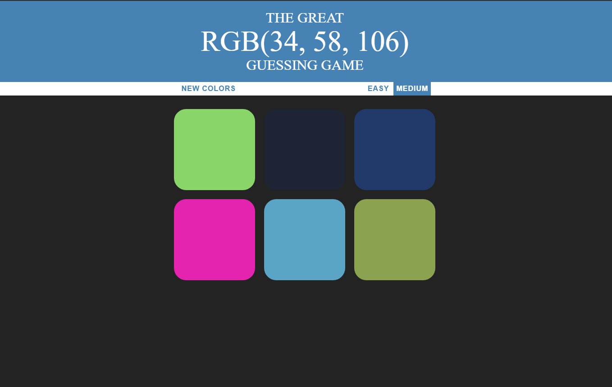
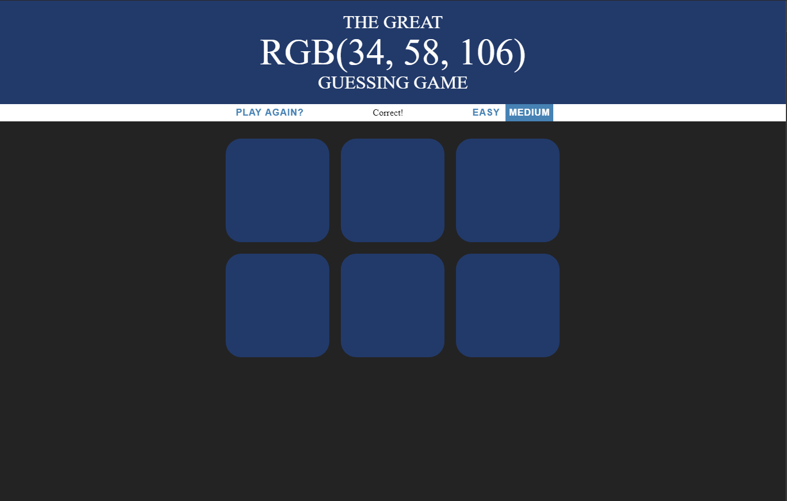

# RGB-Guessing-Game
This Game is very simple:
You get a RGB Color-Code and all you need to do is select the corresponding color:
The game currently has tow modes(Easy and Medium).

Preview of the Game in Medium Mode: 

I built the game with HTML, CSS and plain JS, to improve my JavaScript skills. :D 
Have fun playing.

If you guess correctly: 
